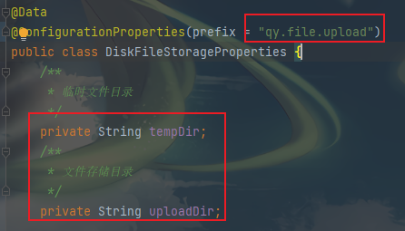

### 关于分片上传&断点续传

**开发环境：JDK8，SpringBoot2.x**

**开发工具：IntelliJ IDEA**

断点续传支持的接口如下：

**checkSha256-文件预检查:**  校验文件sha256,返回已上传文件的字节数与sha256值,实现文件的秒传与断点续传;

**fileResumeUpload-文件上传:** ；通过文件的字节流与文件指针,随机写入文件，实现文件的断点续传；（串行请求）

### 整个流程如下：

1. **校验文件是否存在：**
2. 正式文件是否存在：通过比对文件的sha256值，如果相同，则直接返回该文件的字节数与sha256值（秒传）；如果不相同,则判定文件损坏，清除文件，并重置sha256为空,字节总数为0；
2. 临时文件是否存在：不存在则重置sha256为空，字节大小为0,存在返回该临时文件的字节数与sha256值；
3. **文件上传：**
4. 通过sha256判定是否首次上传，不是则创建临时文件；
5. 根据文件指针与字节流写入文件；
6. 移动临时文件到正式文件目录并记录该文件指纹；（记录文件指纹需重写FileInfoSaveService接口的save()方法）

### 配置说明
1. 需配置临时文件与正式文件目录地址
