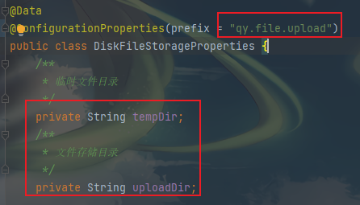

### 关于分片上传&断点续传

**开发环境：jdk1.8,SpringBoot2.x**

**开发工具：IntelliJ IDEA**

断点续传支持的接口如下：

**preCheckFile-文件预检查:**  校验文件sha256,返回已上传文件的字节数与sha256值,实现文件的秒传与断点续传;

**upload-文件上传:** 通过文件的字节流与文件指针,随机写入文件，实现文件的断点续传；

### 配置说明
1. 路径配置：
